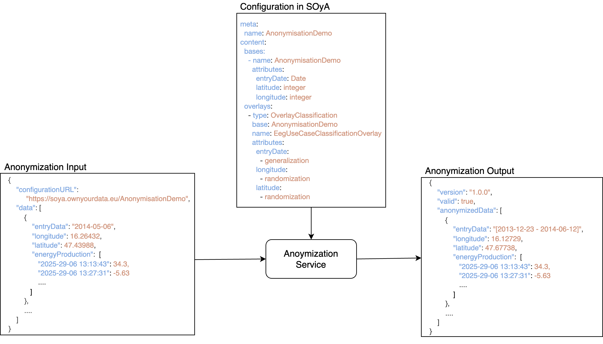
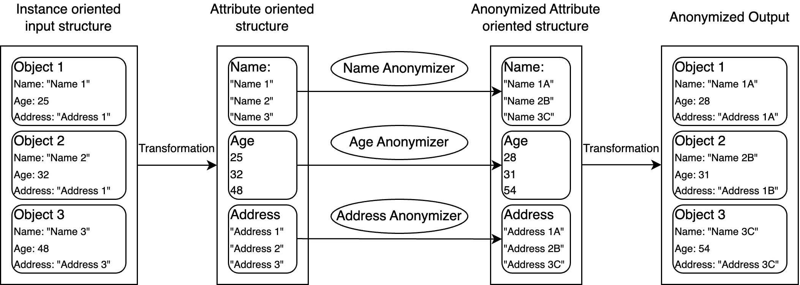
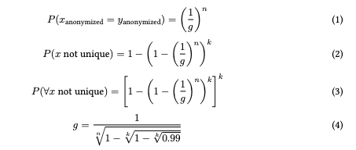
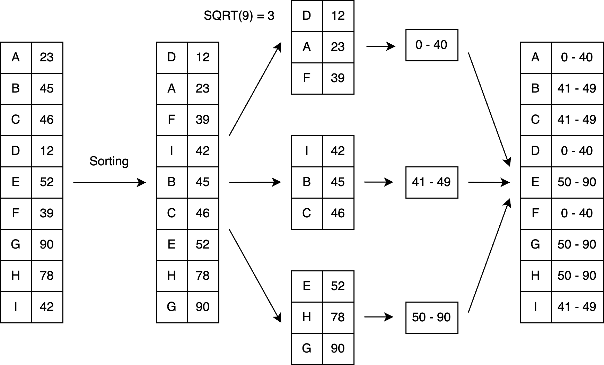
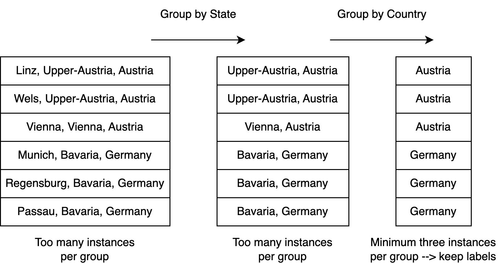

# Anonymisation Service

### General
* Anonymizes personal data to ensure GDPR compliance
* Input: Data to be anonymized along with the anonymization configuration
* The hosted ontology defines the allowed operations for each attribute
* During the anonymization process, an optimizer is created for each attribute
* The allowed anonymization operations depend on the attribute type and datatype, as defined in the ontology
* The implemented anonymization methods are described below
* The swagger documentation of the service is accessible via https://anonymizer.go-data.at/swagger-ui/index.html#/
* The an example scenario


### Anonymization Process
In general, the anonymization process takes place in three steps:
* Fetching of the configuration
* Extracting the configuration form the knowledge graph
* Creation of anonymization operators for each attribute
* Application of the anonymization operators

#### Fetching of the Configuration
At the beginning, the configuration is fetched from the provided URL. The configuration must be stored as a knowledge graph in JSON-LD format. Once the input is fetched, it is validated to ensure that it is valid JSON-LD.

#### Extraction of Configuration
From the knowledge graph, the specific configuration set up for each attribute must be extracted. For each attribute, two pieces of information are important: the expected data type and the intended anonymization type. A SPARQL query is used to find all entities that have AnonymisationDemo as their domain. For those entities, the range attribute defines the data type, and the classification attribute defines the anonymization type.

#### Anonymizer Creation
If the configuration is valid, an anonymizer is instantiated for each attribute. If no implementation is available for the requested anonymization type and the attribute's data type, an exception is returned. The result of this step is a list of anonymizers that can be applied in a loop to anonymize each attribute.

#### Anonymization
To make the anonymizer list applicable, the input data must be restructured. The anonymizer processes data grouped by instance rather than by attribute. Therefore, a list of values is created for each attribute. The corresponding anonymizer is then applied to each list.

An anonymizer takes a list of attribute values as input and returns the anonymized values in the same order. Finally, the anonymized attribute lists are transformed back into an instance-oriented schema.The process is visualized below.


### Anonymization Operations

The service is implemented in a way to enable easy intergration of new anonymization operation.

#### Number of Buckets

For both generalization and randomization, a bucket count (denoted as g) is required. This value is derived from the number of instances k in the dataset and the number of anonymized attributes n. The formula is shown below.

The number of buckets is calculated to ensure at least a 99% probability that no individual in the dataset is uniquely identifiable.

* Line 1 defines the probability that two individuals share the same anonymized values across all attributes.
* Line 2 defines the probability that a given individual is not unique—i.e., at least one other individual has the same anonymized attribute values.
* Line 3 defines the probability that no individual in the dataset is unique.
* In Line 4, the number of buckets is computed by rearranging the formula from Line 3 to determine the required group count that ensures, with at least 99% probability, that all individuals in the dataset are non-unique.


#### Masking

In maksing the attributes is completly hidden. The original value is replaces with the maksing string "****\*". While this ensures full anonymization, no information of the underlying data is kept in the data. This type of anonymization can be applied to every data type. 
Name: "Peter Parker" --> Name: "*****"


#### Generalization

In the generalization the attributes are classified into buckets and the class label is written to the anonymized data set. The number of buckets is defined by the number of instances in the data set:
$$ nrBuckets = \sqrt( numberInstances )$$
Afterwards, the individuals are assigned to buckets based on their value. An approach was chosen in which each bucket constains the same number of values. Thereby, no single buckets are created for outliers making them easily distinguishable from other instances in the anonymized data set. The instances are sorted and then assigned to a bucket based on their position. Based on the values in each a bucket a label for the bucket is created. 

 

##### Generalization for Object

eneralization was also implemented for object data, provided that a hierarchical relationship exists between the attributes. These object attributes must be defined in the configuration. The process then iteratively reduces each data point to its corresponding attribute value, starting from the lowest level in the hierarchy.

If the mapping at the current level achieves sufficient anonymization, those attribute values are returned as the anonymized output. Otherwise, the process continues to the next level in the hierarchy. If anonymization still cannot be achieved at the highest level, masking is applied as a fallback.

Currently, the criterion for "sufficient anonymization" at any level is that each group must contain at least three data points.

A common example where this type of anonymization can be applied is addresses. The process is illustrated in the figure below. It first checks whether using the city-level attribute provides enough anonymization. Since there are six groups with only one value each, this level is not sufficient. The process then evaluates the state level, where three groups are formed—but two of them still contain fewer than three values. Finally, the country level is assessed, and since each group contains at least three values, it is used for output.




#### Randomization

In randomization, a random value is added to each data point. The added value follows a normal distribution, with its spread depending on the number of instances, the distribution of the data, and the number of buckets used. The salt is then the normal distribution multiplied by the distance to the ith closest values, where i is the number of instances per bucket.

https://anonymizer.go-data.at/swagger-ui/index.html#/

<details><summary>Anonymization</summary>

* PUT /api/anonymise

```json
{
    "ontology": "Beispiele/anonymization_ontology.json",
    "data":[
        {
            "Name": "Name 1",
            "Geburtsdatum": "1975-11-01",
            "Adresse": "Musterstraße 1, 1010 St-Pölten, Niederösterreich, Österreich",
            "Gehalt": 10000
        },
        {
            "Name": "Name 2",
            "Adresse": "Musterstraße 1, 1010 Melk, Niederösterreich, Österreich",
            "Geburtsdatum": "1985-12-12",
            "Gehalt": 100000
        },
        {
            "Name": "Name 3",
            "Adresse": "Musterstraße 1, 1010 St-Pölten, Niederösterreich, Österreich",
            "Gehalt": 40000
        },
        {
            "Name": "Name 4",
            "Geburtsdatum": "1950-07-07",
            "Adresse": "Musterstraße 1, 1010 Wien, Wien, Österreich"
        },
        {
            "Geburtsdatum": "1990-01-01",
            "Adresse": "Musterstraße 1, 1010 Wien, Wien, Österreich",
            "Gehalt": 45000
        },
        {
            "Name": "Name 6",
            "Geburtsdatum": "2019-05-14",
            "Gehalt": 12000
        },
        {
            "Name": "Name 7",
            "Geburtsdatum": "1974-01-01",
            "Adresse": "Musterstraße 1, 1010 Wien, Wien, Österreich",
            "Gehalt": 10000
        },
        {
            "Name": "Name 8",
            "Geburtsdatum": "1966-06-06",
            "Adresse": "Musterstraße 1, 1010 Wien, Wien, Österreich",
            "Gehalt": 30000
        },
        {
            "Name": "Name 9",
            "Geburtsdatum": "1979-01-25"
        },
        {
            "Name": "Name 10",
            "Geburtsdatum": "1949-11-01",
            "Gehalt": 20000
        }
    ],
    "configuration":{
        "Name": {
            "anonymisationType": "Masking",
            "dataType": "Numeric"
        }, 
        "Geburtsdatum": {
            "anonymisationType": "Randomization",
            "dataType": "Date"
        }, 
        "Adresse": {
            "anonymisationType": "Generalization",
            "dataType": "Address"
        },
        "Gehalt": {
            "anonymisationType": "Generalization",
            "dataType": "Numeric"
        }
    }
```

* Response
```json
{
   "version":"1.0.0",
   "valid":true,
   "anonymisedData":[
      {
         "Adresse":"Niederösterreich",
         "Geburtsdatum":"1980-05-13",
         "Gehalt":"<= 25000.0",
         "Name":"*****"
      },
      {
         "Adresse":"Niederösterreich",
         "Geburtsdatum":"1973-07-22",
         "Gehalt":">= 25000.0",
         "Name":"*****"
      },
      {
         "Adresse":"Niederösterreich",
         "Gehalt":">= 25000.0",
         "Name":"*****"
      },
      {
         "Adresse":"Wien",
         "Geburtsdatum":"1949-05-19",
         "Name":"*****"
      },
      {
         "Adresse":"Wien",
         "Geburtsdatum":"1980-11-11",
         "Gehalt":">= 25000.0"
      },
      {
         "Geburtsdatum":"2014-03-21",
         "Gehalt":"<= 25000.0",
         "Name":"*****"
      },
      {
         "Adresse":"Wien",
         "Geburtsdatum":"1984-03-22",
         "Gehalt":"<= 25000.0",
         "Name":"*****"
      },
      {
         "Adresse":"Wien",
         "Geburtsdatum":"1959-02-11",
         "Gehalt":">= 25000.0",
         "Name":"*****"
      },
      {
         "Geburtsdatum":"1982-02-11",
         "Name":"*****"
      },
      {
         "Geburtsdatum":"1944-12-05",
         "Gehalt":"<= 25000.0",
         "Name":"*****"
      }
   ]
}
```
